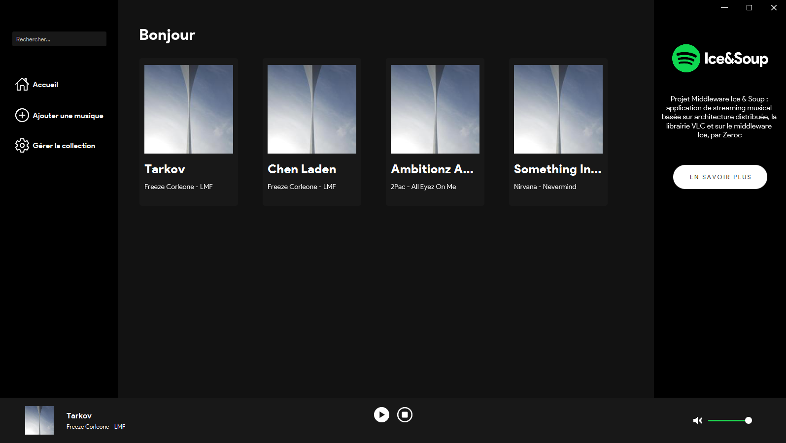
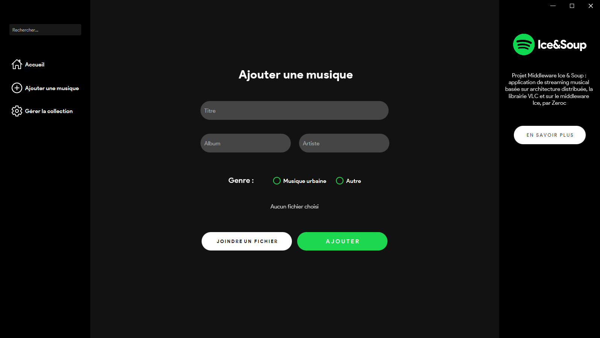

# Application Remake Spotify

Projet Middleware Ice &amp; Soup : application de streaming musical basée sur une architecture distribuée, la librairie VLC et sur le middleware Ice, par Zeroc

*Application développée dans le cadre du master ILSEN au CERI, Université d'Avignon*

# Screenshots

